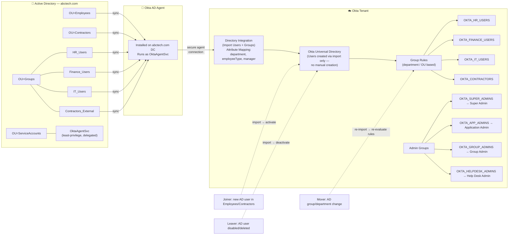

# Lab 7.6 — ABC Tech implementation log

Running design and checkbox log for the AD–Okta project (`abctech.com`). How-to steps remain Labs [7.0](00-lab-ad.md)–[7.5](05-deliverables.md). Update this file as you complete import, group rules, JML, and admin roles.

> If `ServiceAccounts` is in the Okta OU scope, confirm `OktaAgentSvc` / `svc.backup` do **not** become Okta users (Lab 7.1). Stay under 10 active Okta users.

---

# Active Directory – Okta Integration Project
### ABC Tech Solutions

> End-to-end design and implementation log for integrating on-prem Active Directory (`abctech.com`) with Okta as the identity platform, covering directory sync, automated JML (Joiner/Mover/Leaver) lifecycle, group-driven access, and least-privilege admin delegation.

---

## 1. Project Overview

ABC Tech Solutions is a mid-size enterprise (~500 users) using Microsoft Active Directory for user management. This project integrates AD with Okta to centralize authentication, automate user lifecycle management, and enforce role-based access control — with **Active Directory as the single source of truth** for identity.

**Business Objectives**

- Use Active Directory as the source of truth for user identities
- Automate user provisioning and deprovisioning in Okta
- Assign access using groups and group rules
- Implement least-privilege administrative access
- Support Joiner, Mover, Leaver (JML) lifecycle scenarios

---

## 2. Architecture Diagram

**How to read this:** Active Directory (left) is the authoritative source. The Okta AD Agent, running under the least-privilege `OktaAgentSvc` account, is the only bridge between the two environments. It feeds AD users, security groups, and key attributes into Okta's Directory Integration, which creates and updates Okta users — manual user creation is explicitly disallowed. Okta Group Rules then translate raw AD state (department, OU, group membership) into clean, purpose-built Okta groups, which drive both application access and administrative role assignment. The dotted lines show how Joiner/Mover/Leaver events in AD ripple through automatically.

---

## 3. Active Directory Design

### 3.1 Forest & Domain

- New standalone AD forest created: **`abctech.com`**
- Set up via **Add a new forest** in the AD DS Configuration Wizard (not a child domain — a fully independent forest root)

### 3.2 Organizational Units (OUs)

| OU | Purpose |
|---|---|
| `OU=Employees,DC=abctech,DC=com` | Full-time employees |
| `OU=Contractors,DC=abctech,DC=com` | External contractors (limited access) |
| `OU=ServiceAccounts,DC=abctech,DC=com` | Service accounts, including `OktaAgentSvc` |
| `OU=Groups,DC=abctech,DC=com` | Security groups (added for organizational clarity — not explicitly required by the brief, but keeps identity and access objects separated) |

### 3.3 AD Security Groups

- `HR_Users`
- `Finance_Users`
- `IT_Users`
- `Contractors_External`

### 3.4 Key User Attributes Synced to Okta

| Attribute | AD Location | Notes |
|---|---|---|
| `department` | Organization tab (ADUC) | Drives Okta group rule logic |
| `manager` | Organization tab (ADUC) | Standard AD attribute |
| `employeeType` | Not exposed in ADUC GUI | Set via PowerShell: `Set-ADUser <user> -Add @{employeeType="Employee"}` (or `"Contractor"`). Verify via `Get-ADUser <user> -Properties employeeType`, or in ADUC under **View → Advanced Features → Attribute Editor** tab. |

---

## 4. Implementation Log

### ✅ 4.1 VM & AD DS Setup
- [x] Provisioned Windows Server VM (`AbcTech.com`) in VirtualBox
- [x] Installed AD DS role
- [x] Promoted server as a **new forest** root domain: `abctech.com`

### ✅ 4.2 OU & Group Structure
- [x] Created `Employees`, `Contractors`, `ServiceAccounts`, `Groups` OUs
- [x] Created `HR_Users`, `Finance_Users`, `IT_Users`, `Contractors_External` security groups
- [x] Created test users across `Employees` and `Contractors`, assigned to matching groups
- [x] Set `department` and `manager` via ADUC; set `employeeType` via PowerShell

### ✅ 4.3 Least-Privilege Service Account — `OktaAgentSvc`
- [x] Created `OktaAgentSvc` user account inside `OU=ServiceAccounts`
- [x] **Removed** the account from **Domain Admins** (avoiding the common but over-privileged shortcut)
- [x] Delegated only the permissions the Okta AD Agent actually needs, scoped to `Employees` and `Contractors`, via **Delegation of Control Wizard**:
  - Object type scope: **Only the following objects in the folder → User objects**, with **Create selected objects** and **Delete selected objects** checked
  - Permissions granted: **Read All Properties**, **Write All Properties**, **Reset password**
- [x] Repeated the delegation on the `Contractors` OU

> This satisfies the project's "least-privilege administrative access" objective — the service account can fully manage user lifecycle within its two scoped OUs, and nothing else in the domain.

### ✅ 4.4 Okta AD Agent Installation
- [x] Downloaded the Okta AD Agent from the Okta admin console
- [x] Installed on the `abctech.com` domain controller
- [x] Configured the agent to run as **`OktaAgentSvc@abctech.com`** (chose "Use an alternate account that I specify," rather than letting the installer create its own default account)
- [x] Registered the agent against the Okta org, authenticated as Super Admin, granted API access

### 🔄 4.5 Directory Integration Configuration (In Progress)
- [x] Scoped OU sync to `Employees`, `Contractors`, `ServiceAccounts` (Users and Groups)
- [x] Set Okta username format to **UPN**
- [x] Added `department`, `manager`, and `employeeType` to the custom schema during profile setup
- [ ] Run initial **Full Import**
- [ ] Confirm users and groups appear correctly on the Import tab

---

## 5. Remaining / Planned Steps

### 5.1 Okta Group Strategy
Create native Okta groups and drive their membership with **Group Rules** (not manual assignment):

| Okta Group | Rule Logic (planned) |
|---|---|
| `OKTA_HR_USERS` | `user.department == "HR"` |
| `OKTA_FINANCE_USERS` | `user.department == "Finance"` |
| `OKTA_IT_USERS` | `user.department == "IT"` |
| `OKTA_CONTRACTORS` | `user.employeeType == "Contractor"` (or OU-based) |

### 5.2 Administrative Access Model
Assign admin roles **only via groups**, never to individual accounts:

| Group | Role |
|---|---|
| `OKTA_SUPER_ADMINS` | Super Administrator |
| `OKTA_APP_ADMINS` | Application Administrator (scoped) |
| `OKTA_GROUP_ADMINS` | Group Administrator (scoped) |
| `OKTA_HELPDESK_ADMINS` | Help Desk Administrator |

Contractors must never receive membership in any of the above.

### 5.3 JML Lifecycle Validation

| Scenario | Test Steps | Expected Result |
|---|---|---|
| **Joiner (Employee)** | Create user in `Employees` OU → import | User created & activated in Okta, correctly grouped |
| **Joiner (Contractor)** | Create user in `Contractors` OU → import | User created with **only** `OKTA_CONTRACTORS`, no other access |
| **Mover** | Change AD group/department → re-import | Group Rules re-evaluate, user's Okta group membership updates automatically |
| **Leaver** | Disable/delete AD user → import | User automatically deactivated in Okta |

### 5.4 Deliverables Checklist
- [x] Architecture diagram (this document)
- [ ] Group and rule logic explanation (drafted above — finalize after rules are built)
- [ ] Screenshots of configurations and tests
- [ ] Test cases with results (table above — fill in Actual Result / Pass-Fail columns)

---

## 6. Notes on Scope

**Federation Service (AD FS) was intentionally not configured.** This project's requirements center on import-based directory integration (Okta AD Agent pulling identity from AD) and group-driven lifecycle automation — not federated/delegated authentication using on-prem Windows credentials. AD FS would only be relevant if the brief required WS-Federation/SAML-based sign-in against AD, which it does not.

---

*Document generated as a running log of the AD–Okta integration lab. Update the checkboxes and the JML test-case table as each remaining step is completed.*
