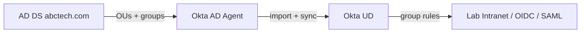

# Week 7 — AD as source of truth (ABC Tech project)

This is the **Active Directory – Okta Integration** project, mapped onto the same Integrator org as Weeks 1–6. Do **not** stop Week 2 SSO. Keep Test User and Jamie as **Okta-sourced** accounts for OIDC/SAML. ABC Tech identities must come from AD only.

**Time:** ~11.5h (plus a Windows Server eval VM if you do not already have a lab domain)  
**Org cap:** 10 active Okta users. Budget: Super Admin + Test User + Jamie + **six** AD users = 9.

## How it fits

| You already did | This project uses it as |
|-----------------|-------------------------|
| Week 1 groups + rules | Same idea, driven by **AD group / OU**, not a hand-typed `department` |
| Week 1 admin roles on Jamie | Admin roles on **groups**, never on a contractor |
| Week 4.3 CSV import | CSV was a stand-in. AD Agent is the real inbound source |
| “Manual users in Okta” for labs | Forbidden for ABC Tech people. Allowed only for the SSO test accounts |

## Architecture

AD is authoritative for create / update / disable. Okta does not invent ABC employees.

## Business rules (from the project)

- Source of truth: **Active Directory**
- OUs: `Employees`, `Contractors`, `ServiceAccounts` (do **not** import service accounts)
- AD groups: `HR_Users`, `Finance_Users`, `IT_Users`, `Contractors_External`
- Okta groups: `OKTA_HR_USERS`, `OKTA_FINANCE_USERS`, `OKTA_IT_USERS`, `OKTA_CONTRACTORS`
- JML: joiner in Employees OU activates; contractors limited; AD group change = mover; AD disable/delete = Okta deactivate
- Admin via groups only: Super Admin, App Admin, Group Admin, Helpdesk. **Contractors never get admin**

## Labs

| Lab | Time | File |
|-----|------|------|
| 7.0 Lab AD forest | 3h | [00-lab-ad.md](00-lab-ad.md) |
| 7.1 Agent + import + mappings | 2h | [01-agent-and-import.md](01-agent-and-import.md) |
| 7.2 Groups and rules | 1.5h | [02-groups-and-rules.md](02-groups-and-rules.md) |
| 7.3 Joiner / mover / leaver | 2h | [03-jml.md](03-jml.md) |
| 7.4 Admin roles via groups | 1.5h | [04-admin-rbac.md](04-admin-rbac.md) |
| 7.5 Deliverables | 1.5h | [05-deliverables.md](05-deliverables.md) |

## When to run this

After **Week 1** you have enough Okta UI skill to start 7.0. After **Week 4.3** the mental model (inbound source) is easier. Finish **2.2 SAML** in the SSO track first if you are mid-week-2; then either continue 2.3 or start 7.0 if the VM is ready.
