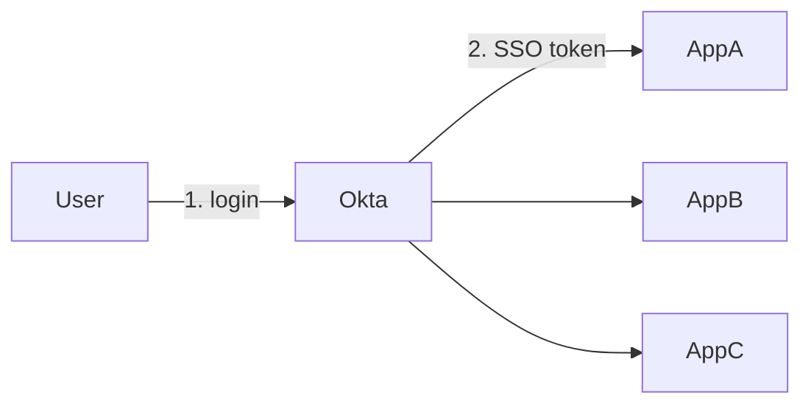
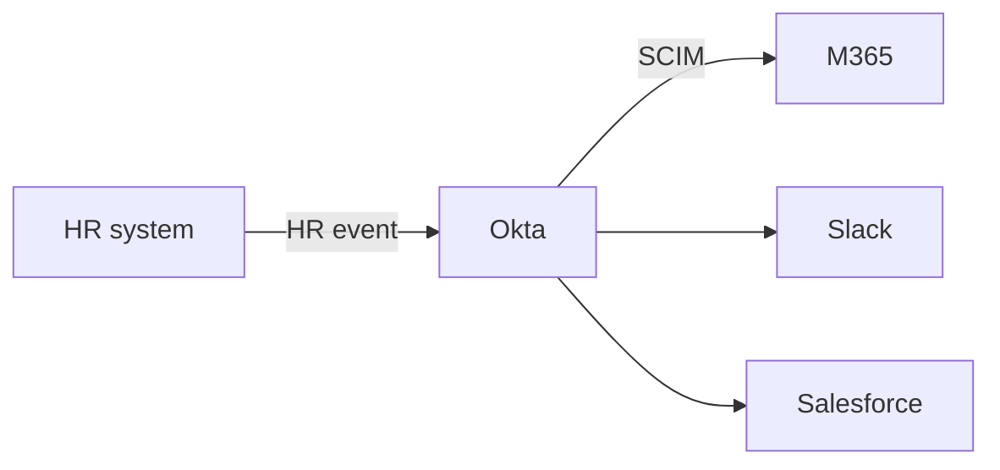

# Ten problems Okta actually solves

Field guide: each problem with the architecture, protocol, and where Okta sits. Converted from `Okta_Use_Case_Field_Guide.html`.

## At a glance

| Use case | Okta product | Core mechanism |
|----------|--------------|----------------|
| Single sign-on | Workforce Identity | SAML / OIDC |
| Adaptive MFA | Workforce Identity | Risk-based step-up |
| Lifecycle management | Workforce Identity | SCIM |
| Universal Directory | Workforce Identity | AD / HRIS import |
| API access management | Workforce Identity | OAuth 2.0 / JWT |
| Customer identity | Auth0 (CIAM) | Universal Login |
| B2B partner federation | Workforce Identity | SAML / OIDC federation |
| Zero trust access | Workforce Identity | Device posture signal |
| Identity governance | + Saviynt / SailPoint | Access certification |
| Non-human / AI identity | Workforce Identity | Client credentials + token exchange |

These labs cover Workforce rows (SSO, MFA, lifecycle, directory, APIs). CIAM, B2B federation at scale, and IGA platforms stay out of scope until later.

## 01 — Single sign-on

**Problem:** Employees juggle a different login for every app.

One authentication at Okta issues a session every connected app trusts. Protocols: SAML, OIDC, session cookie.

Labs **2.1 OIDC** and **2.2 SAML**.

## 02 — Adaptive multi-factor authentication

**Problem:** A correct password is not proof the right person is typing it.

Okta scores context (device, location, network) at sign-in and only interrupts with a second factor when risk crosses a threshold. Factors: Okta Verify, WebAuthn, risk signals.

Lab **3.1–3.2**. Friction scales with risk instead of applying uniformly.

## 03 — Lifecycle management

**Problem:** Manual account create and revoke is slow; offboarding gets missed.

An HR event (hire, transfer, termination) flows into Okta, which provisions or deprovisions downstream apps over SCIM (JML).

Labs **4.1–4.2** and **Week 7** (AD as HR/AD source).

## 04 — Universal Directory

**Problem:** Identity data is scattered across systems of record.

Okta ingests AD, HR, and other sources into one mastered profile. Apps read that record.

Lab **1.1** and **7.1** (AD Agent import). Do not **Add person** for ABC Tech identities.

## 05 — API access management

**Problem:** APIs need a scalable way to verify caller identity and permissions.

A client gets a token from Okta’s authorization server; the API validates signature and scopes locally against JWKS — no callback on every request. OAuth 2.0, JWT.

Labs **5.2–5.3**.

## 06 — Customer identity (CIAM)

**Problem:** Customer-facing apps need signup without owning password security.

Auth0 hosts login and signup (social, passwordless) and hands the app a token. Out of scope for this Workforce lab path.

## 07 — B2B partner federation

**Problem:** A partner wants staff to use their own credentials, not an account you manage.

Okta federates with the partner IdP over SAML or OIDC. Trust crosses the org boundary; passwords do not. Org2Org is **not** on Integrator Free Plan.

## 08 — Zero trust / device-bound access

**Problem:** A correct password from an untrusted device is still a risk.

Okta checks device posture (managed, compliant, patched) with identity and can block unmanaged devices. Labs **3.2–3.3** (policies and zones) are the Integrator-sized version.

## 09 — Identity governance and certification

**Problem:** Knowing who *can* log in is not knowing who still *should*.

Okta authenticates; an IGA platform (Saviynt, SailPoint) handles requests, approvals, and periodic certification. Revocation flows back through Okta. Out of scope here.

## 10 — Non-human and AI agent identity

**Problem:** Agents and service accounts need governing too.

The agent uses client credentials, gets a narrowly scoped short-lived token, and every action is logged under its identity. Lab **5.1** (OAuth for Okta APIs) is the closest hands-on analog.
